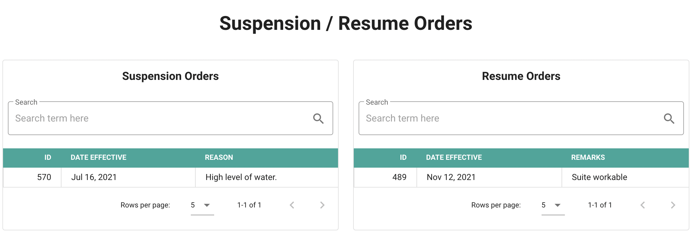
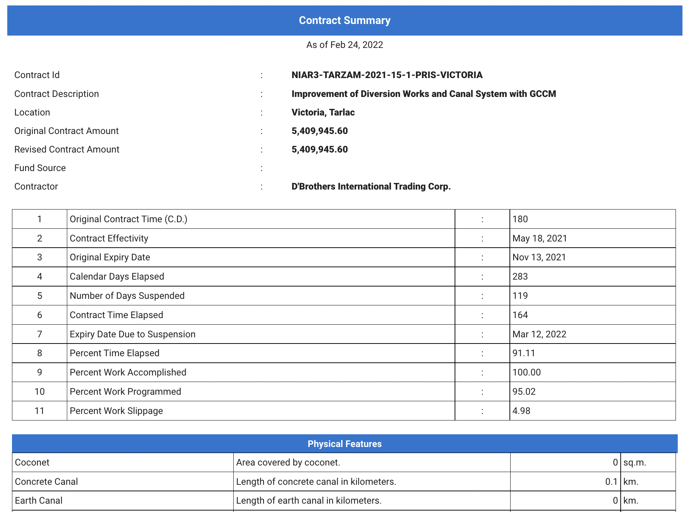
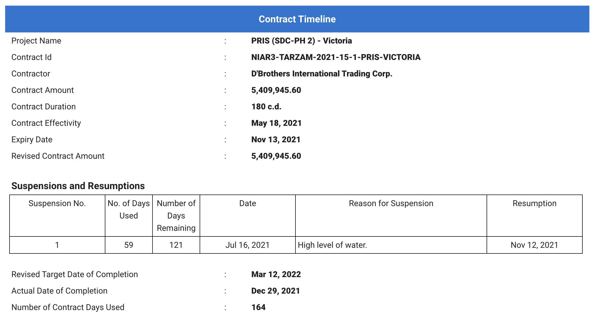
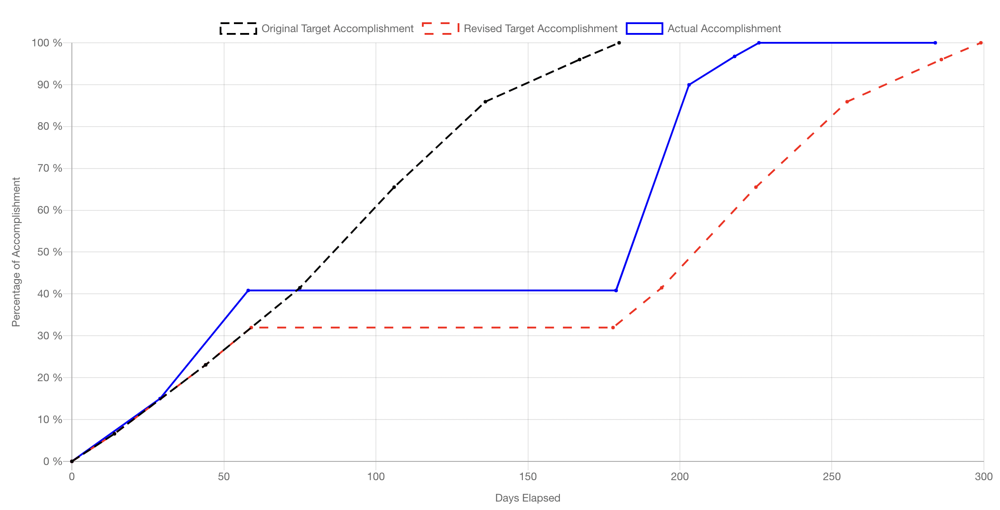
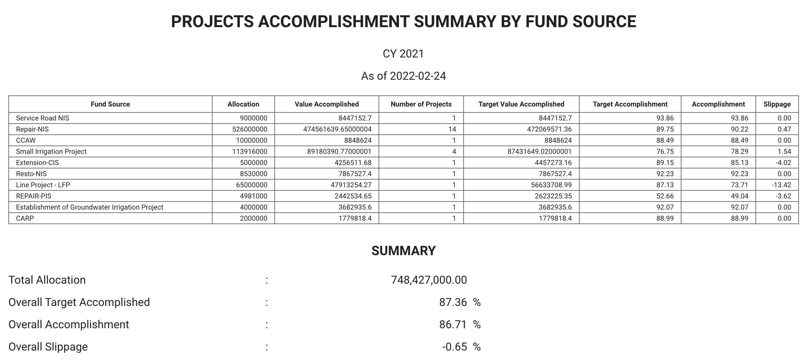

# Features
--- 
## Project Detail

Shows a short summary of a project. Here are some of the details/data shown by this feature/page.

- Name
- Description
- Fund Source
- System/Category
- Amount in (PhP)
- Expenditure Sources
- Expenditures
- Contract or List of Contracts

## Contract Detail

Short a detailed information about the contract. Here are some of the details/data shown by this feature/page.

- Contract ID
- Description
- Start Date / Contract Effectivity
- Duration
- Expiry Date
- Revised Expiry Date
    - Auto calculated based on suspensions
- Original Amount
- Revised Amount
    - Reflected based on variation orders
- Contractor
- Project In Charge
- Contract S-Curve

## Contract Suspension and Resumptions

This page let the user suspend a contract and resumes it. It lists all the suspension and resumption orders for the contract. Any input here is reflected in the contract `s-curve` and the `revised target completion date`.

## Contract Summary

Contract summary shows basic details of a contract as well as computed properties such as `expiry date due to suspensions` and `slippage`. It can also be downloaded to be used for attachments to reports in excel format.

## Contract Timeline

Contract timeline shows the basic data of a contract including the summary of suspensions and resumptions if any, of a contract. This also reflects the actual completion of the contract.

## Contract S-Curve

In inputting the s-curve data, up to two users are ideally involved, 1st is the `admin` who inputs the original projected accomplishments and the `project-in-charge` that enters the progress accomplishments by a certain period intervals.

The s-curve in `PSMS` reflects the revised projected curve (shown by the red curve), which was automatically calculated by interpolating with the suspensions and resumptions.

## Physical Features

Physical features are components of infrastructure contracts that are measurable. They can be added in PSMS to monitor the impact of a certain project. The following are example of physical features:

- Length of Road
- Number of Canal Structures
- Length of Concrete Canal
- Number of beneficiaries
- Generated Area for Irrigation, etc.

Any metric can be added by the system user.

They are added as accomplishments accompanied by date of accomplishment.

## Contracts Summary Per CY

This feature lists all contracts by year of implementation. Each entry shows the contract details summary including the computed properties of the contract.

## Summary of Negative Slippage Per Cy

This shows lists of contracts with same details as above, but only filters the entries that incurred negative slippages.

## Projects Summary Per CY

This lists all the projects by year of implementation, grouped by fund sources. Each project shows a contract or contracts under it showing the contract details. This also shows the financial accomplishments of a project and is calculated automatically based on the `finance user` inputs.

This list can be filtered by only showing the fund sources that the user wants to display.

## Projects Summary Per Fund Source Per CY

This is a concise summary of projects packed as fund sources. This features shows how much is accomplished by fund source and also the overall performance for the implementation year selected.